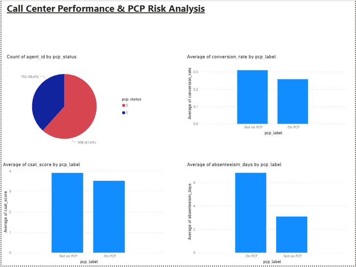

# Call Center Performance & PCP Risk Analysis
## Business Problem
Identify underperforming agents early to improve performance and reduce operational risk.

## Overview
This project analyzes call center agent performance and predicts the likelihood of agents being placed on a Performance Improvement Plan (PCP).

## Tools Used
- Python (Pandas, NumPy, Scikit-learn)
- Power BI

## Key Insights
- Agents on PCP have lower conversion rates
- Lower CSAT is linked to poor performance
- Absenteeism is a strong predictor of PCP risk
- Longer talk time does not guarantee better outcomes

## Model
- Logistic Regression (~78% accuracy)

## Dashboard
See dashboard screenshot in /images folder

## Dashboard Preview

